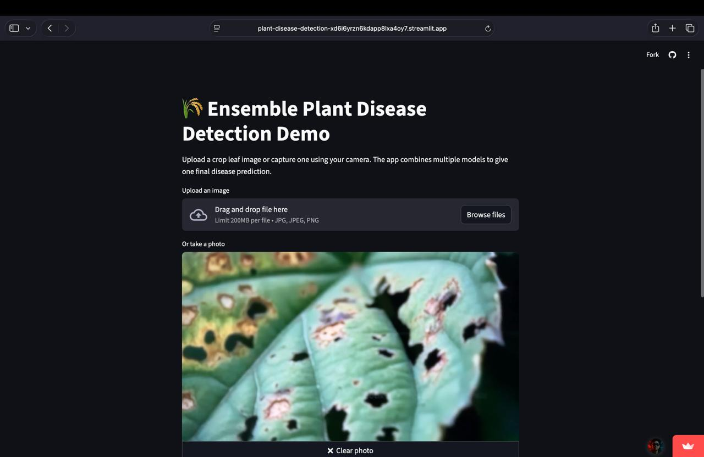
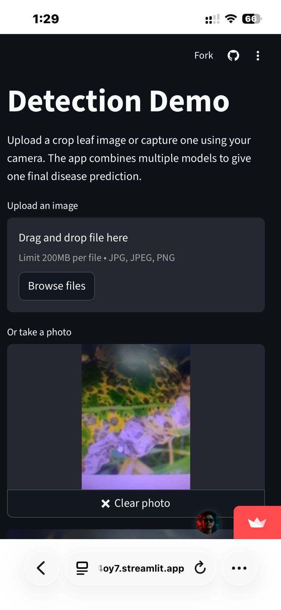

# 🌾 Ensemble Plant Disease Detection

| WebView | Mobile View |
|---------|-------------|
|  |  |


---

## 🚀 Features
- Upload a crop leaf image (JPG/PNG).
- Auto-detect both **crop type** and **disease type**.
- Uses **ensemble voting** across three models:
  - [PlantVillage MobileNetV2](https://huggingface.co/linkanjarad/mobilenet_v2_1.0_224-plant-disease-identification)
  - [Rice Leaf Disease Model](https://huggingface.co/prithivMLmods/Rice-Leaf-Disease)
  - [Crop Leaf Diseases ViT](https://huggingface.co/wambugu71/crop_leaf_diseases_vit)
- Final prediction chosen by **majority vote** (or highest confidence if all disagree).
- Clean UI built with Streamlit.

---

## 🛠️ Tech Stack
- Python 3.10+
- Streamlit
- PyTorch
- Hugging Face Transformers
- Pillow
- NumPy

---

## 📦 Installation

```bash
git clone https://github.com/pibarel27/Plant-Disease-Detection.git
cd Plant-Disease-Detection
pip install -r requirements.txt
